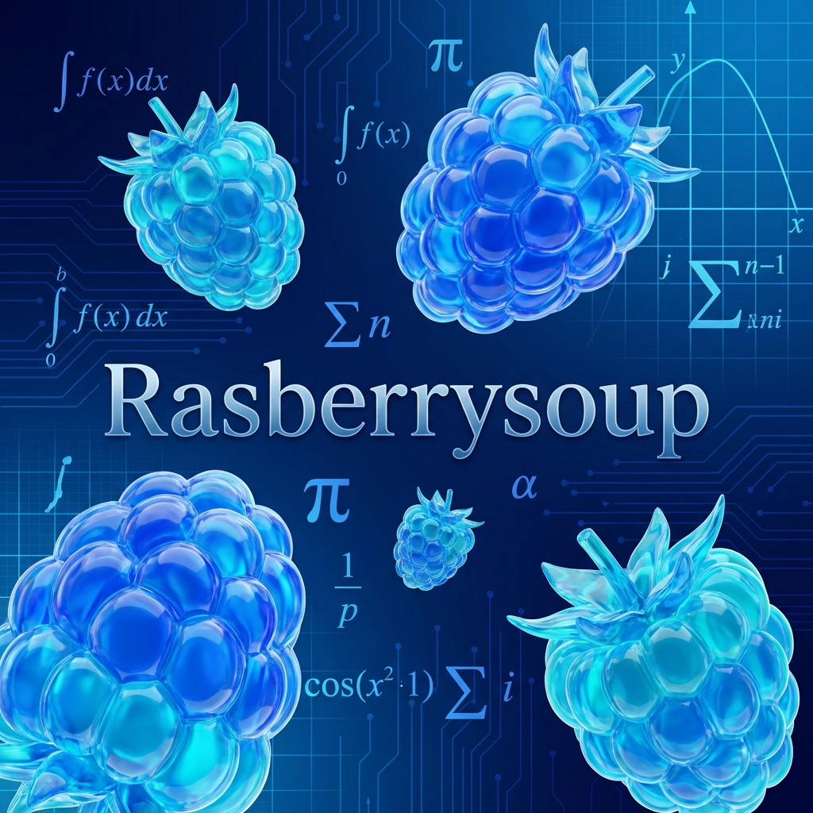

# 🍧 라즈베리수프 (Rasberrysoup)



**라즈베리수프(Rasberrysoup)**는 복잡한 수학 연산을 직관적인 키워드 기반 함수 호출로 단순화하도록 설계된 전문적인 Python 라이브러리입니다. 원래 C++ 라이브러리였던 이 프로젝트는 Python으로 새롭게 이식되어, 일반적인 공학 및 과학 작업을 위한 고성능 구현을 제공합니다.

## ✨ 주요 기능

- **이차방정식 풀이 (`quad`)**: 복소수 해를 지원하는 $ax^2 + bx + c = 0$ 풀이.
- **황금비 (`gold`)**: 미적 및 수학적 설계를 위한 고정밀 상수 제공.
- **푸리에 변환 (`fourier`)**: 신호 분석을 위한 간소화된 이산 변환(DFT).
- **유클리드 거리 (`dist`)**: 다차원 거리 계산.
- **복리 계산 (`interest`)**: 빠른 재무 성장 모델링.

## 🚀 설치 방법

소스 코드에서 직접 라즈베리수프를 설치할 수 있습니다:

```bash
pip install .
```

## 🔧 사용법

```python
from rasberrysoup import quad, gold, dist

# 1. 황금비 확인
print(f"Golden Ratio: {gold()}")

# 2. 이차방정식 풀이 (x^2 - 5x + 6 = 0)
roots = quad(1, -5, 6)
print(f"Roots: {roots}")

# 3. 거리 계산
d = dist([0, 0], [3, 4])
print(f"Distance: {d}")
```

---
**작성자:** Rheehose (Rhee Creative)
**Copyright:** © 2008-2026
**라이선스:** MIT
