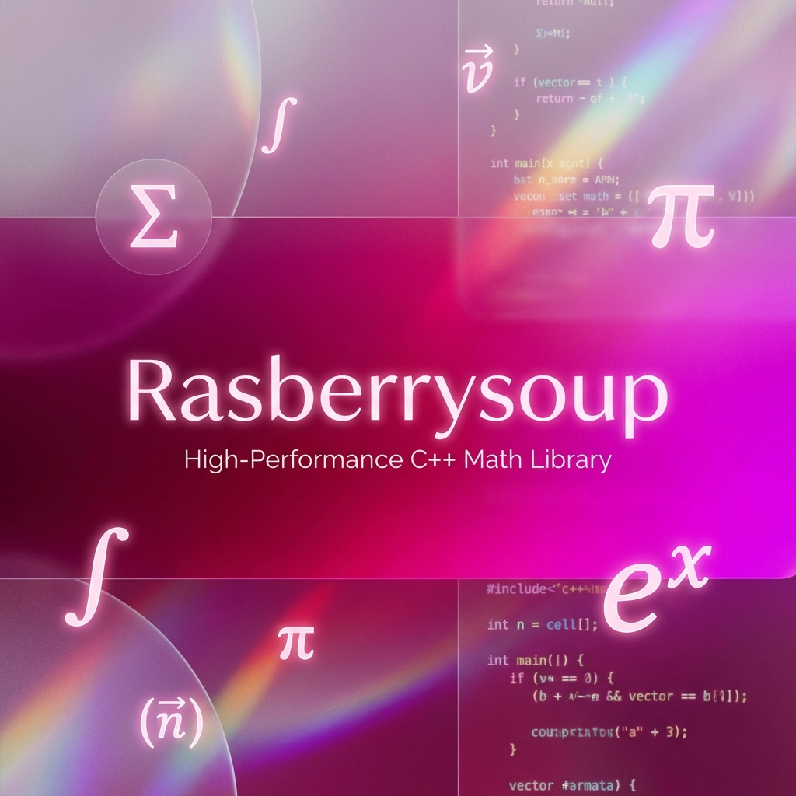

# 🍧 Rasberrysoup



**Rasberrysoup** is a professional C++ header-only library designed to simplify complex mathematical operations into intuitive keyword-based function calls. Developed by **Rheehose (Rhee Creative)**, it provides high-performance implementations for common engineering and scientific tasks.

## ✨ Key Features

- **Quadratic Solver (`quad`)**: Solve ax² + bx + c = 0 with complex root support.
- **Golden Ratio (`gold`)**: High-precision constant for aesthetic and mathematical design.
- **Fourier Transform (`fourier`)**: Simplified discrete transform for signal analysis.
- **Euclidean Distance (`dist`)**: Multi-dimensional distance calculations.
- **Compound Interest (`interest`)**: Fast financial growth modeling.

## 🚀 Installation via VCPKG

This package is hosted on the [HSLCRB Registry Hub](https://github.com/hslcrb/vcpkg_hslcrb-s_pkgs).

1. Add the registry to your `vcpkg-configuration.json`:
```json
{
  "registries": [
    {
      "kind": "git",
      "repository": "https://github.com/hslcrb/vcpkg_hslcrb-s_pkgs",
      "packages": [ "rasberrysoup" ]
    }
  ]
}
```

2. Install:
```bash
vcpkg install rasberrysoup
```

---
**Author:** Rheehose (Rhee Creative)
**Copyright:** © 2008-2026
**License:** MIT
